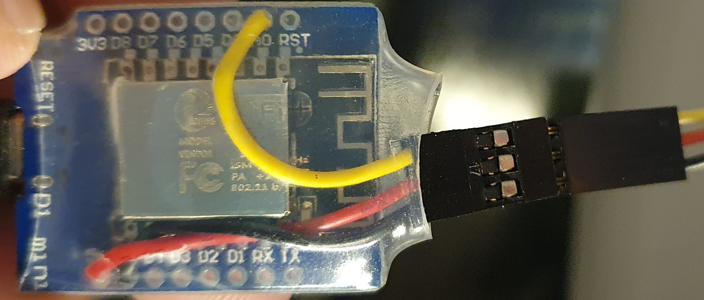

# d1pymqttanalog
MicroPython based program for sending analog values to mqtt

## Problems / ToDo
### Optimize Wifi connection
Since the wifi connection is done in `boot.py`, thonny is unable to communicate with the device if no wifi connection can be established, once the code is uploaded. This should be improved!

## Resources
The MQTT lib (umqttsimple.py) is taken from: https://raw.githubusercontent.com/RuiSantosdotme/ESP-MicroPython/master/code/MQTT/umqttsimple.py

## How I upload the stuff using Linux (maybe this also works with WSL2)
### Setup esptool
1) Create a venv: `python3 -m venv ~/dev/esptool_venv`
1) Install esptool in the venv: `~/dev/esptool_venv/bin/pip install esptool`
1) Make the tool available without path: `ln -s ~/dev/esptool_venv/bin/esptool.py ~/.local/bin/esptool`

### Flash micropython
1) Download the latest version of micropython from [micropython.org](https://micropython.org/download/ESP8266_GENERIC/)
1) Erase the flash: `esptool --port /dev/ttyUSB0 erase_flash`
1) Upload micropython: `esptool --port /dev/ttyUSB0 --baud 1000000 write_flash --flash_size=4MB -fm dio 0 PATH_TO_ESP8266_GENERIC-VERSION.bin`

### Thonny
To upload the files to the esp, use [Thonny](https://thonny.org). It is available for all platforms and supports micro- and circuitpython.

1) Create a `config.json`
2) Upload `boot.py`, `umqttsimple.py`, `main.py` and `config.json` with thonny

## Wiring

